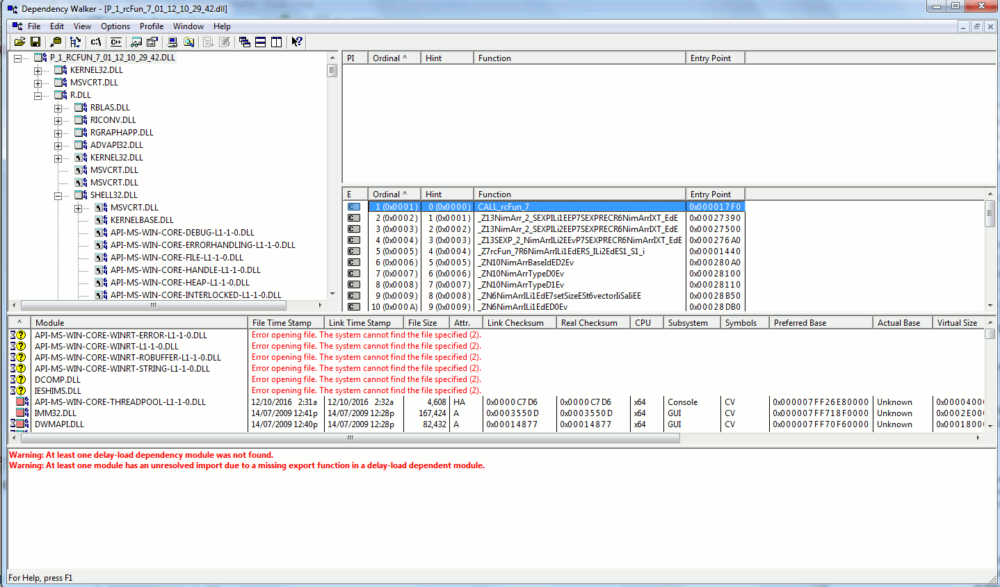

```{r setup, include=FALSE}
knitr::opts_chunk$set(echo = TRUE)
```

So in previous posts I talked about how the R package `nimble` can be used to make fast functions to aid in writing fast simulations in R (here, and here). If your simulation are based on a system of ordinary differential equations (ODEs), then you've probably used the R package `deSolve` before. `deSolve` provides a number of functions for solving ODEs. Under the hood it uses C to speedup all of the iterations necessary to solve ODEs, which usually rely on approximating continuous time equations by calculating the equations over a number of small timesteps (so this can be a lot of iteration). Normally you write the ODEs out in an R function, however, which limits ulimately the speed of `deSolve`. `deSolve` does offer the ability to input a compiled DLL object that contains routines compiled in C or Fortran, which can greatly speed up computation in some cases. Here I will try and see if just compiling a function using `nimble` and then passing that as an R function to `deSolve` will be as fast as trying to compile the same function into a DLL and then passing that to `deSolve`.

First we'll have to decide on a model to test this on. I'm going to start with a simple Lotka-Volterra style competition model for testing. I'll allow a flexible number of species in the model. Here's a basic implementation in base R, which we can compare the performance to. Parameters are a matrix of competition coefficients, a vector of initial growth rates,and a vector of carrying capacities (eg. (here)[https://en.wikipedia.org/wiki/Competitive_Lotka%E2%80%93Volterra_equations]).

```{r base_R_model}
library(nimble)
library(deSolve)

## setup a three specie system for testing
nspec <- 3
r <- 1
K <- 2
parms <- list()
parms$nspec <- nspec
parms$a <- matrix(runif(nspec^2), nrow = nspec, ncol = nspec)
diag(parms$a) <- 1
parms$r <- rep(r, nspec)
parms$K <- rep(K, nspec)
y <- runif(nspec, 0, 2)
LV_mod_base <- function(t, y, parms) {
  comp <- colSums(matrix(y, nrow = parms$nspec, ncol = parms$nspec) * parms$a)
  new_y <- parms$r * y * (1 - (comp / K))
  list(new_y)
}

system.time(test <- ode(y, 1:1000, LV_mod_base, parms))
plot(test)

system.time(test <- ode(y, 1:1000, LV_mod_base, parms, method = "rk4"))
plot(test)

```

So that seems to work more or less. It looks like the Runge-Kutta method of integration takes more time than the default `lsoda` method. I've optimized it to use vectorization within R, which should give it a fighting chance against the `nimble` compiled version. Let's try a larger system with more species to see if we can get it to run slow.

```{r bigger_R_base}
nspec <- 300
r <- 1
K <- 2
parms <- list()
parms$nspec <- nspec
parms$a <- matrix(runif(nspec^2), nrow = nspec, ncol = nspec)
diag(parms$a) <- 1
parms$r <- rep(r, nspec)
parms$K <- rep(K, nspec)
y <- runif(nspec, 0, 2)

system.time(test <- ode(y, 1:1000, LV_mod_base, parms))
plot(test, select = sample(nspec, 9))


```
At this point I don't really care if I've correctly specified the model, or the dynamics. I just want to know if the compiled version gives me the same answer but faster. So now I'll make the same model using `nimble`. The biggest problem to be solved here is that `deSolve` requires a function that outputs a list, but a `nimbleFunction` cannot output that type. So I will have to have a wrapper R function to feed in the parameters and format the output. This could add considerably to the overhead, so we will see whether we can get good performance.

```{r}
LV_mod_nimble <- nimbleFunction(
  run = function(y = double(1), a = double(2), r = double(1), K = double(1), nspec = integer(0)) {
    
    new_y <- numeric(length = nspec, value = 0, init = TRUE)
    
    for (i in 1:nspec) {
      new_y[i] <- r[i] * y[i] * (1 - (sum(a[ , i]*y) / K[i]))
    }
    
    return(new_y)
    returnType(double(1))
  }
)

##test
nspec <- 3
r <- 1
K <- 2
parms <- list()
parms$nspec <- nspec
parms$a <- matrix(runif(nspec^2), nrow = nspec, ncol = nspec)
diag(parms$a) <- 1
parms$r <- rep(r, nspec)
parms$K <- rep(K, nspec)
y <- runif(nspec, 0, 2)

test1 <- LV_mod_base(0, y, parms)[[1]]
test2 <- LV_mod_nimble(y, parms$a, parms$r, parms$K, parms$nspec)
identical(test1, test2)

LV_mod_nimble_cmp <- compileNimble(LV_mod_nimble, showCompilerOutput = TRUE)

```

So now we will create an R function to wrap this `nimbleFunction`, so it will work with `deSolve`. Then we can compare the speed.

```{r wrapper}
LV_mod_nimble_wrap <- function(t, y, parms) {
  list(LV_mod_nimble_cmp(y, parms$a, parms$r, parms$K, parms$nspec))
}

nspec <- 300
r <- 1
K <- 2
parms <- list()
parms$nspec <- nspec
parms$a <- matrix(runif(nspec^2), nrow = nspec, ncol = nspec)
diag(parms$a) <- 1
parms$r <- rep(r, nspec)
parms$K <- rep(K, nspec)
y <- runif(nspec, 0, 2)

system.time(test1 <- ode(y, 1:1000, LV_mod_base, parms))
system.time(test2 <- ode(y, 1:1000, LV_mod_nimble_wrap, parms))

all.equal(test1[[1]], test2[[1]])

system.time(test1 <- ode(y, 1:1000, LV_mod_base, parms, method = "rk4"))
system.time(test2 <- ode(y, 1:1000, LV_mod_nimble_wrap, parms, method = "rk4"))

all.equal(test1[[1]], test2[[1]])

```
Well, that made a massive difference, especially using the Runge-Kutta methods. The 'lsoda' methods was only about twice as fast with `nimble`, but that is possibly because most of the time was spent in just setting up the model and 'deciding' what methods to use ('lsoda' methods switches between 'stiff' and 'non-stiff' methods internally to maximize integration efficiency). On the other hand, Runge-Kutta is a straightforward iterating algorithm, which takes much longer, but shouldn't have much overhead. There, the difference is very clear. The `nimbleFunction` was around 20 times faster. So it definitely seems worthwhile to write the differential equation function in `nimble`. Now, the only question is, will we see any further performance gain if we are able to compile the `nimbleFunction` into a shared object, and then input that into `deSolve`? 
Since `nimble` has compiled the function and we can use it in R, it must have compiled it to a shared object somewhere. Perhaps we can simply access that already compiled shared object? I'm using Windows, so there should be a DLL somewhere. Having a look around in the `nimble` package environment, we find a hidden variable which might be what we're looking for. It's a filename for a DLL in a temporary directory. 

```{r find_DLL}
nimbleUserNamespace$sessionSpecificDll
str(nimbleUserNamespace$sessionSpecificDll)

```
But I don't know what C symbol I should call to run the function. Having a look in the temporary directory that holds the .DLL I see another .DLL which looks more promising. It's names something like "P_1_rcfun_1_etc.dll", with a bunch of numbers instead of "_etc". I had a look in that .DLL using dependency walker. The function we want. 



It is called "CALL_rcfun_x", where x is some number. I wonder if we can access this name through `nimble` somehow? I noticed that the `compileNimble` function has the option to specify a 'project'. I can't seem to find too much info on projects in `nimble`, but it seems to be a object used internally by the package. I can creat a new one by accessing an unexported function in `nimble`. This is generally not recommended to do, but until I find a better solution, I'll give it a try.

```{r}
nim_proj <- nimble:::nimbleProjectClass()
nim_proj$projectName
LV_mod_nimble_new <- compileNimble(LV_mod_nimble, showCompilerOutput = TRUE, project = nim_proj)
```


It is looking like I can't use the `nimble` compiled DLL in `deSolve` because